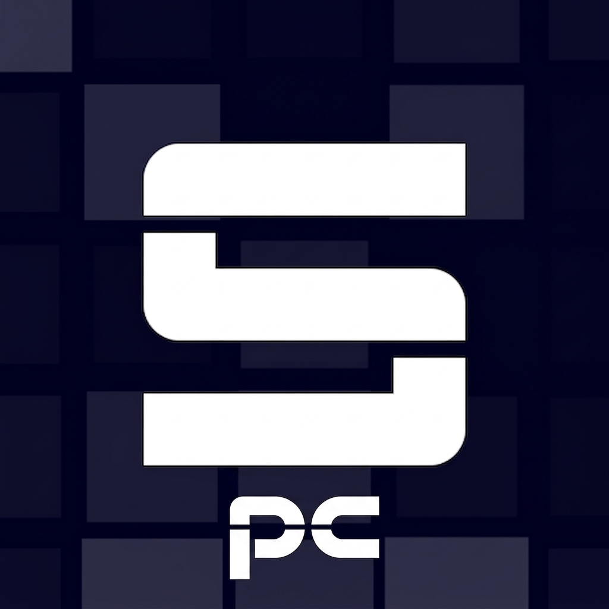

<p align="center">
  
</p>

<h1 align="center">Sonopc</h1>
<p align="center"><strong>Play Project SEKAI rhythm charts right in your browser.</strong></p>

<p align="center">
  <a href="LICENSE"></a>
  
  
  
</p>

---

## ✨ Features

- **Real chart data** — charts are parsed with the exact semantics of the community reference
  converter ([sonolus-level-converters](https://github.com/UntitledCharts/sonolus-level-converters)), validated note-for-note
  against it on all 10 included charts.
- **All note types** — taps, criticals, **directional flicks** (`↑ ← →`), traces, damage notes, and slides
  that actually glide across lanes with visible ticks and end-flicks.
- **Lane-accurate** — fixes the classic off-by-one lane mapping (notes were shifted and the rightmost lane dropped).
- **Combo parity** — slide starts, visible ticks and slide ends all count as combo events, just like the game.
- **In-app player** — start screen, live score/accuracy/combo HUD, results with max combo, replay.
- **Autoplay** — sit back and watch the chart play itself.
- **Note speed slider** — 0.5x–2.5x visual fall rate (saved to your browser; judgment is unaffected).
- **Menu music** — loops on the level list and pauses while you play.
- **Difficulty picker** — every chart with its real difficulty level (`MASTER · Lv.34`, …).

### 🎵 Included songs
| Song | Difficulties |
|---|---|
| The Intense Voice of Hatsune Miku | Easy · Normal · Hard · Expert · Master |
| Mesmerizer | Easy · Normal · Hard · Expert · Master |

## 🎮 Controls

| Input | Action |
|---|---|
| `A S D F G H J K L ; ' \` | Hit lanes 1–12 |
| Click / tap a lane | Hit that lane |
| **Auto play** toggle | Let the game play the chart |
| **Note speed** slider | 0.5x–2.5x fall speed |
| `←` button (top-left of the player) | Quit back to the level list |

## 🚀 Getting started

```bash
git clone https://github.com/AtaberkCelil/Sonolus-Pc.git
cd Sonolus-Pc
pnpm install        # or: npm install
pnpm dev            # dev server → http://localhost:3000
```

Other scripts:

```bash
pnpm check          # TypeScript type-check
pnpm build          # production build → dist/
pnpm verify:parity  # diff chart parsing against the reference converter
pnpm preview        # serve the production build
pnpm start          # serve the build with the bundled Node server
```

> **Keep chart/audio assets in `public/`.** The `dist/` folder is disposable build output and is wiped on every build.

## 🗂 Project structure

```
src/
├── game/
│   ├── susParser.ts      # Ched/SUS chart parser (official channel semantics)
│   └── gameEngine.ts     # canvas renderer + hit judgment + scoring
├── components/
│   └── PlayScreen.tsx    # in-app player UI
├── pages/
│   └── Home.tsx          # level list + difficulty modal + menu music
├── types.ts              # shared Level / note types
└── index.css             # all styling
public/
├── logo.jpg              # app logo (original artwork)
├── covers/               # jacket art
├── levelinfo/            # chart files (SUS) + audio
└── menumusic/            # level-list music
menu/                     # original standalone PC player (legacy)
```

## 🧠 How the chart pipeline works

1. **`susParser.ts`** reads the Ched/SUS text format exactly like the game data:
   - `1x` channels → taps / criticals / traces / damage
   - `5x` channels → air directions (`1` up, `3` left, `4` right) and slide easing
   - `3x` channels → slide streams (start / visible ticks / hidden steps / end), deduped like the game
   - drops marker-only notes, fever lanes, padding lanes, and tap-on-slide overlaps
2. **`gameEngine.ts`** turns that into a playable chart: fall speed, judgments
   (`PERFECT / GREAT / GOOD / MISS`), combo, score, accuracy, slide-tick combo events.
3. **`PlayScreen.tsx`** fetches the chart, wires the HUD, and handles start → play → results.

## 🎯 Chart accuracy

Combo counts are **note-for-note identical to the reference converter**
([UntitledCharts/sonolus-level-converters](https://github.com/UntitledCharts/sonolus-level-converters))
on all 10 bundled charts — reproduce it yourself with `pnpm verify:parity`
(see [`tools/verify-parity/`](tools/verify-parity/)), which runs both parsers over
the same files and fails on any difference:

| Chart | Combo events | | Chart | Combo events |
|---|---|---|---|---|
| TIVoHM Easy | 409 | | Mesmerizer Easy | 271 |
| TIVoHM Normal | 707 | | Mesmerizer Normal | 440 |
| TIVoHM Hard | 963 | | Mesmerizer Hard | 761 |
| TIVoHM Expert | 1520 | | Mesmerizer Expert | 1218 |
| TIVoHM Master | 1742 | | Mesmerizer Master | 1451 |

That check compares more than the total — it also diffs the per-kind breakdown
(`single` / `start` / `relay` / `continuation` / `end`), the critical split inside
each kind, the playable note counts, the guide notes, and the chart duration.

This required implementing the parts of the format that a naive parse drops:

- **`long_continuations`** — every hold implicitly produces extra combo events on each
  half-beat (240 ticks) until it ends. This is the single largest source of combo; without
  it a chart like TIVoHM Hard reports 636 events instead of 963.
- **Slide step types** — type `3` is a *visible* relay (adds combo), type `5` only changes
  the trace shape (adds nothing), and type `3` marked as *step-ignore* becomes an `attach`.
- **`judgeType`** — hidden holds (channel `1` types `7`/`8`) are not judged, and friction
  slides (types `5`/`6`) are traced rather than tapped.
- **Per-point criticality** — a slide's start and ticks inherit the slide's own
  criticality, but its **end** is critical if *either* the slide or the endpoint is.
  Getting this wrong still yields the right combo *count* with the wrong notes, which
  is why the parity check compares the critical split and not just the totals.
- **Guide channels (`9x`)** are parsed and rendered as translucent guide paths
  (yellow when critical, green otherwise). They are visual only and never add combo.
  Mesmerizer ships 26 of them (78 points); TIVoHM has no channel-9 data.

## ✋ Hold & release detection

Slides are real holds, not free combo:

- The body must be **held** — at least one lane the trace passes through stays pressed.
- **Releasing early** breaks the hold: the body turns red and the remaining
  relay/continuation events are scored `MISS`, breaking the combo.
- A small grace window (`RELEASE_GRACE`, 80 ms) at the end of the body forgives an
  early release, and window blur is treated as a release so you never get stuck holding.
- **Autoplay** satisfies every hold automatically.

## 🙏 Credits & licensing

- **Project SEKAI: Colorful Stage!** is ©SEGA / Colorful Palette. Songs, jackets and chart data belong to them.
  This project is an unofficial, non-commercial fan recreation — no affiliation or endorsement.
- Chart files: [sekai.best asset storage](https://storage.sekai.best/sekai-jp-assets/music/music_score/)
  (Ched 2.7 SUS exports).
- Parser semantics reference: [UntitledCharts/sonolus-level-converters](https://github.com/UntitledCharts/sonolus-level-converters).
- Logo: original design for this project.

## 📄 License

[MIT](LICENSE) © 2026 AtaberkCelil
